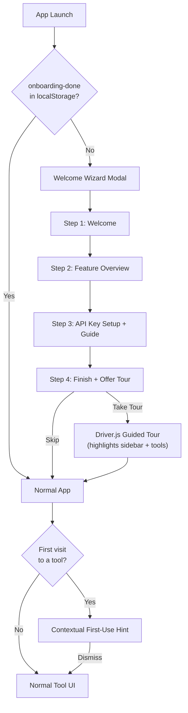

# FitHelper Onboarding System Design

> Version: 0.3.0 (draft)
>
> Adds a hybrid onboarding system: first-launch welcome wizard, Driver.js
> guided tour, and contextual first-use hints per tool.

---

## Table of Contents

1. [Goals & Approach](#1-goals--approach)
2. [Architecture Overview](#2-architecture-overview)
3. [Part 1 — Infrastructure](#3-part-1--infrastructure)
4. [Part 2 — Welcome Wizard](#4-part-2--welcome-wizard)
5. [Part 3 — Guided Tour (Driver.js)](#5-part-3--guided-tour-driverjs)
6. [Part 4 — Contextual First-Use Hints](#6-part-4--contextual-first-use-hints)
7. [Part 5 — Enhanced Settings Page](#7-part-5--enhanced-settings-page)
8. [Part 6 — Internationalization](#8-part-6--internationalization)
9. [Part 7 — Tests](#9-part-7--tests)
10. [Cursor AI Prompt](#10-cursor-ai-prompt)

---

## 1. Goals & Approach

### Problem

FitHelper currently has no onboarding. New users land directly on the Pace
Converter with no guidance. The AI Coach feature requires an OpenAI API key,
but the Settings page provides no instructions on how to obtain one.

### Chosen Approach: Hybrid Onboarding

After evaluating four approaches (wizard-only, coach-marks-only, contextual
hints-only, and hybrid), the **hybrid** approach was selected:

| Layer | What | When |
|-------|------|------|
| **Welcome Wizard** | 4-step modal overlay | First launch only |
| **Guided Tour** | Driver.js coach marks on real UI | After wizard (optional) or on-demand |
| **First-Use Hints** | Dismissible cards per tool | First visit to each tool |

### Key Decisions

- **Driver.js** (~5 KB) for the tour layer — lightweight, vanilla JS, easy to theme.
- **localStorage** for all onboarding state — no DB schema changes.
- **`settings:testApiKey`** IPC channel — validates API key before saving.
- All strings through **react-i18next** (zh + en).

---

## 2. Architecture Overview



### New Files

```
src/renderer/components/Onboarding/
├── WelcomeWizard.tsx      # 4-step first-launch modal
├── ApiKeyGuide.tsx         # Reusable "How to get a key" sub-component
├── guidedTour.ts           # Driver.js tour definition + launcher
├── driverTheme.css         # Dark-palette overrides for Driver.js
└── FirstUseHint.tsx        # Dismissible per-tool hint card
```

### Modified Files

| File | Change |
|------|--------|
| `src/main/ipc/settings.ts` | Add `settings:testApiKey` handler |
| `src/main/services/openai.ts` | (no change — testApiKey creates its own temporary client) |
| `src/shared/types.ts` | Add `testApiKey` to `ElectronAPI.settings` |
| `src/preload.ts` | Wire `settings:testApiKey` |
| `src/renderer/App.tsx` | Render wizard, wire tour launcher |
| `src/renderer/components/Sidebar.tsx` | Add `id` attributes to nav buttons + lang toggle; add "?" tour button |
| `src/renderer/components/Settings/Settings.tsx` | Add collapsible guide, Test Connection button, OpenAI link |
| `src/renderer/components/PaceConverter/PaceConverter.tsx` | Wrap with `<FirstUseHint>` |
| `src/renderer/components/CalorieLibrary/CalorieLibrary.tsx` | Wrap with `<FirstUseHint>` |
| `src/renderer/components/DailyTracker/DailyTracker.tsx` | Wrap with `<FirstUseHint>` |
| `src/renderer/components/TrainingLog/TrainingLog.tsx` | Wrap with `<FirstUseHint>` |
| `src/renderer/i18n/en.json` | Add onboarding + settings strings |
| `src/renderer/i18n/zh.json` | Add onboarding + settings strings |

---

## 3. Part 1 — Infrastructure

### 3.1 Install Driver.js

```bash
npm install driver.js
```

Driver.js provides `highlight()` and `drive()` APIs with built-in overlay,
popover positioning, and step navigation. It needs minimal CSS theming to match
the dark palette.

### 3.2 New IPC Channel: `settings:testApiKey`

A new IPC handler in `src/main/ipc/settings.ts` that makes a lightweight
OpenAI API call to validate a key before saving.

**Type addition** in `src/shared/types.ts`:

```typescript
settings: {
  getApiKeyStatus: () => Promise<{ configured: boolean }>;
  setApiKey: (key: string) => Promise<void>;
  clearApiKey: () => Promise<void>;
  testApiKey: (key: string) => Promise<{ valid: boolean; error?: string }>;
};
```

**Handler implementation** (in `src/main/ipc/settings.ts`):

- Instantiate a temporary `new OpenAI({ apiKey })` client.
- Call `client.models.list()` — cheapest endpoint, zero token cost.
- Return `{ valid: true }` on success.
- Return `{ valid: false, error: message }` on failure.

**Preload wiring** (in `src/preload.ts`):

```typescript
testApiKey: (key: string) =>
  ipcRenderer.invoke('settings:testApiKey', { key }),
```

### 3.3 Onboarding Persistence

Use `localStorage` keys (consistent with the existing `fithelper-lang`
pattern):

| Key | Set When | Value |
|-----|----------|-------|
| `fithelper-onboarding-done` | Wizard completes | `"true"` |
| `fithelper-tour-done` | Guided tour completes | `"true"` |
| `fithelper-hint-seen-{toolId}` | User dismisses a tool's hint | `"true"` |

No database schema changes are required.

---

## 4. Part 2 — Welcome Wizard

### File: `src/renderer/components/Onboarding/WelcomeWizard.tsx`

A full-screen overlay modal with 4 steps, rendered by `App.tsx` when
`fithelper-onboarding-done` is not set in localStorage.

### Step 1 — Welcome

- App logo/name, tagline ("A lightweight health utility").
- Brief 1-sentence description of what FitHelper does.
- "Get Started" button to advance.

### Step 2 — Feature Overview

- 4 cards in a 2×2 grid, each showing tool name + 1-line description:

| Card | Description |
|------|-------------|
| Pace Converter | Convert between mph and min/km instantly |
| Calorie Library | Your personal food calorie reference |
| Daily Tracker | Track daily intake with smart suggestions |
| Training Log + AI Coach | Log workouts and get AI coaching |

### Step 3 — API Key Setup

- Heading: "Set up AI Coach (optional)".
- Explanation: "The AI Coach analyzes your training and gives personalized
  advice. It requires an OpenAI API key."
- Numbered instructions:
  1. Visit [platform.openai.com/api-keys](https://platform.openai.com/api-keys)
     (opens in system browser via `shell.openExternal`).
  2. Sign up or log in to your OpenAI account.
  3. Click "Create new secret key", give it a name, copy it.
  4. Paste it in the input below.
- Password input + **"Test & Save"** button:
  - Calls `settings:testApiKey` first.
  - On success: calls `settings:setApiKey`, shows green check + success message.
  - On failure: shows red error message, does not save.
- Status indicator states: idle → testing (spinner) → valid (green) / invalid (red).
- **"Skip for now"** link at bottom (user can configure later in Settings).

This numbered-instructions sub-component (`ApiKeyGuide.tsx`) is shared with the
enhanced Settings page (Part 5).

### Step 4 — Done

- Success message: "You're all set!"
- Summary of API key status (configured / skipped).
- Two buttons:
  - **"Take a Quick Tour"** → launches Driver.js tour, then closes wizard.
  - **"Start Using FitHelper"** → closes wizard directly.
- Sets `fithelper-onboarding-done` to `"true"` in localStorage.

### Integration in App.tsx

```typescript
const [showWizard, setShowWizard] = useState(
  () => !localStorage.getItem('fithelper-onboarding-done')
);

// In render:
{showWizard && (
  <WelcomeWizard
    onComplete={(startTour) => {
      localStorage.setItem('fithelper-onboarding-done', 'true');
      setShowWizard(false);
      if (startTour) launchGuidedTour(setActiveTool);
    }}
  />
)}
```

### Wizard Layout

```
┌─────────────────────────────────────────────────┐
│                                                 │
│  (semi-transparent dark overlay)                │
│                                                 │
│    ┌─────────────────────────────────────┐      │
│    │                                     │      │
│    │   Step content renders here         │      │
│    │                                     │      │
│    │   ● ○ ○ ○   (step indicator dots)   │      │
│    │                                     │      │
│    │   [ Back ]          [ Next / Done ] │      │
│    └─────────────────────────────────────┘      │
│                                                 │
└─────────────────────────────────────────────────┘
```

- Overlay: `position: fixed`, full viewport, `background: rgba(0,0,0,0.7)`,
  `z-index: 10000`.
- Card: centered, `max-width: 600px`, `background: var(--color-bg-primary)`,
  rounded corners, surface border.

---

## 5. Part 3 — Guided Tour (Driver.js)

### File: `src/renderer/components/Onboarding/guidedTour.ts`

A function `launchGuidedTour(onToolChange: (id: number) => void)` that creates
a Driver.js instance with steps highlighting real DOM elements.

### DOM IDs Required

Add `id` attributes to `Sidebar.tsx`:

| Element | ID |
|---------|-----|
| Tool 1 nav button | `sidebar-tool-1` |
| Tool 2 nav button | `sidebar-tool-2` |
| Tool 3 nav button | `sidebar-tool-3` |
| Tool 4 nav button | `sidebar-tool-4` |
| Tool 5 nav button | `sidebar-tool-5` |
| Language toggle button | `sidebar-lang-toggle` |

### Tour Steps

| Step | Target | Popover Description | Side Effect |
|------|--------|---------------------|-------------|
| 1 | `#sidebar-tool-1` | "Pace Converter — quickly convert running pace between mph and min/km." | `onToolChange(1)` |
| 2 | `#sidebar-tool-2` | "Calorie Library — browse and manage your food calorie database." | `onToolChange(2)` |
| 3 | `#sidebar-tool-3` | "Daily Tracker — set a calorie target and log your meals throughout the day." | `onToolChange(3)` |
| 4 | `#sidebar-tool-4` | "Training Log + AI Coach — record workouts and get AI-powered advice." | `onToolChange(4)` |
| 5 | `#sidebar-tool-5` | "Settings — configure your OpenAI API key anytime." | `onToolChange(5)` |
| 6 | `#sidebar-lang-toggle` | "Switch between English and Chinese with one click." | — |

On each step activation, call `onToolChange(toolId)` so the content area
updates to show the relevant tool as the tour progresses.

### Driver.js Theming

Create `src/renderer/components/Onboarding/driverTheme.css` with overrides:

```css
.driver-popover {
  background: var(--color-surface);
  color: var(--color-text-primary);
  border: 1px solid var(--color-border);
}
.driver-popover .driver-popover-title {
  color: var(--color-accent);
}
.driver-popover .driver-popover-next-btn,
.driver-popover .driver-popover-prev-btn {
  background: var(--color-accent);
  color: #fff;
  border: none;
  border-radius: 4px;
}
.driver-popover .driver-popover-close-btn {
  color: var(--color-text-secondary);
}
```

### Trigger Points

1. End of Welcome Wizard — user clicks "Take a Quick Tour".
2. Sidebar footer — a small "?" button (always visible) that re-launches the tour.

### Re-launch Button in Sidebar

Add a "?" button next to the language toggle in `Sidebar.tsx`:

```typescript
<button
  id="sidebar-tour-btn"
  onClick={onStartTour}
  title={t('onboarding.tour.relaunch')}
  style={{ /* small icon button styling */ }}
>
  ?
</button>
```

This requires adding an `onStartTour` callback prop to `Sidebar`.

---

## 6. Part 4 — Contextual First-Use Hints

### File: `src/renderer/components/Onboarding/FirstUseHint.tsx`

A reusable component that shows a dismissible hint card at the top of a tool's
content area on first visit.

### Interface

```typescript
interface FirstUseHintProps {
  toolId: number;
  children: React.ReactNode;
}
```

### Behavior

1. On mount, check `localStorage.getItem('fithelper-hint-seen-{toolId}')`.
2. If not set → render the hint card.
3. On dismiss (click "×") → set localStorage key, animate card out (opacity
   fade, 200ms).

### Visual Style

```
┌──────────────────────────────────────────────┐
│ ▎ Hint text goes here...                  ✕  │
└──────────────────────────────────────────────┘
```

- `background: var(--color-surface)`
- `border-left: 3px solid var(--color-accent)`
- `border: 1px solid var(--color-border)` (remaining sides)
- `border-radius: 6px`
- `padding: 12px 16px`
- `margin-bottom: 16px`
- "×" dismiss button, top-right

### Hint Content Per Tool

| Tool | Hint Text |
|------|-----------|
| 1 — Pace Converter | "Type a speed or pace value — conversion happens automatically. Use the swap button to change direction." |
| 2 — Calorie Library | "This is your personal food database. The app comes with preset items — feel free to add, edit, or delete any of them." |
| 3 — Daily Tracker | "Set today's calorie target, add food items, and toggle them between planned and eaten. Drag to reorder your meal plan." |
| 4 — Training Log | "Write your training notes in any format. When you save, the AI Coach will analyze your progress." + (if no API key configured): "Set up your API key in Settings to enable AI Coach." |

### Integration

Each tool component adds the hint at the top of its render:

```tsx
<FirstUseHint toolId={1}>
  {t('onboarding.hint.tool1')}
</FirstUseHint>
```

Tool 4 (TrainingLog) additionally checks API key status for the conditional
message.

---

## 7. Part 5 — Enhanced Settings Page

Update `src/renderer/components/Settings/Settings.tsx` with three additions:

### 7.1 "How to Get an API Key" Section

A collapsible/expandable section below the API key input, reusing the
`ApiKeyGuide.tsx` sub-component from the wizard. Default state: collapsed if
key is already configured, expanded if not.

### 7.2 "Test Connection" Button

- Visible when a key is already configured.
- Calls `settings:testApiKey` with the currently saved key (read via a new
  `settings:getApiKey` — or test the existing encrypted key by adding a
  `settings:testSavedKey` channel that decrypts + tests in main process).
- Shows inline result: green "Connection successful" or red "Connection failed:
  {error}".

Implementation note: To avoid exposing the decrypted key to the renderer, add a
`settings:testSavedKey` IPC handler that reads the encrypted key in main process
and runs the test there. This keeps the key in main-process memory only.

### 7.3 External Link

"Manage your keys on OpenAI" link that calls `shell.openExternal(
'https://platform.openai.com/api-keys')`.

This requires exposing a generic `openExternal(url)` method via preload, or a
dedicated `settings:openKeyManagement` IPC channel.

---

## 8. Part 6 — Internationalization

Add all new strings to both `src/renderer/i18n/en.json` and
`src/renderer/i18n/zh.json`.

### New i18n Keys

```json
{
  "onboarding": {
    "welcome": {
      "title": "Welcome to FitHelper",
      "subtitle": "A lightweight health utility — quick tools to help you live healthier.",
      "getStarted": "Get Started"
    },
    "features": {
      "title": "What's Inside",
      "converter": "Convert between mph and min/km instantly.",
      "calorie": "Your personal food calorie reference.",
      "daily": "Track daily intake with smart suggestions.",
      "training": "Log workouts and get AI coaching."
    },
    "apiKey": {
      "title": "Set up AI Coach (optional)",
      "description": "The AI Coach analyzes your training and gives personalized advice. It requires an OpenAI API key.",
      "step1": "Visit platform.openai.com/api-keys",
      "step2": "Sign up or log in to your OpenAI account",
      "step3": "Click \"Create new secret key\", give it a name, copy it",
      "step4": "Paste it below",
      "testAndSave": "Test & Save",
      "testing": "Testing...",
      "valid": "Key is valid!",
      "invalid": "Key is invalid: {{error}}",
      "skip": "Skip for now"
    },
    "done": {
      "title": "You're all set!",
      "keyConfigured": "AI Coach is ready to go.",
      "keySkipped": "You can set up the AI Coach later in Settings.",
      "takeTour": "Take a Quick Tour",
      "startApp": "Start Using FitHelper"
    },
    "tour": {
      "relaunch": "Take a tour",
      "step1": "Pace Converter — quickly convert running pace between mph and min/km.",
      "step2": "Calorie Library — browse and manage your food calorie database.",
      "step3": "Daily Tracker — set a calorie target and log your meals.",
      "step4": "Training Log + AI Coach — record workouts and get AI-powered advice.",
      "step5": "Settings — configure your OpenAI API key anytime.",
      "step6": "Switch between English and Chinese with one click."
    },
    "hint": {
      "tool1": "Type a speed or pace value — conversion happens automatically. Use the swap button to change direction.",
      "tool2": "This is your personal food database. The app comes with preset items — feel free to add, edit, or delete any of them.",
      "tool3": "Set today's calorie target, add food items, and toggle them between planned and eaten. Drag to reorder.",
      "tool4": "Write your training notes in any format. When you save, the AI Coach will analyze your progress.",
      "noApiKey": "Set up your API key in Settings to enable AI Coach."
    }
  },
  "settings": {
    "howToGetKey": "How to get an API key",
    "testConnection": "Test Connection",
    "testSuccess": "Connection successful — your key works.",
    "testFailed": "Connection failed: {{error}}",
    "manageKeys": "Manage your keys on OpenAI"
  }
}
```

Chinese translations (`zh.json`) should mirror the same structure with
appropriate Chinese text.

---

## 9. Part 7 — Tests

### Unit Tests

| Test File | What to Test |
|-----------|-------------|
| `tests/settings-testApiKey.test.ts` | `settings:testApiKey` handler — mock OpenAI SDK, verify `{ valid: true }` on success and `{ valid: false, error }` on failure |
| `tests/WelcomeWizard.test.tsx` | Step navigation (1→2→3→4), skip API key flow, "Test & Save" flow (mock IPC), localStorage flag set on complete |
| `tests/FirstUseHint.test.tsx` | Renders hint when localStorage key absent, hides after dismiss click, does not render when localStorage key present |

### E2E Tests

Update `e2e/happy-path.spec.ts`:

- First-launch scenario: wizard appears, navigate through all 4 steps, skip API
  key, close wizard, verify app loads normally and `fithelper-onboarding-done`
  is set.
- Second launch: wizard does NOT appear.
- Tour: click "?" button in sidebar, verify Driver.js overlay appears.

---

## 10. Cursor AI Prompt

Below is a self-contained prompt you can paste into a new Cursor AI chat to
implement this entire feature. It includes all the context and instructions
needed.

---

```
Implement a hybrid onboarding system for FitHelper (Electron 41 + React 19 + Vite + TypeScript). The app currently has NO onboarding, modals, or guided tour. Follow the AGENTS.md rules (write tests first, run all tests, commit after passing).

## What to build

### 1. `settings:testApiKey` IPC channel
- In `src/main/ipc/settings.ts`, add a handler `settings:testApiKey` that takes `{ key: string }`, creates a temporary `new OpenAI({ apiKey: key })`, calls `client.models.list()` (cheapest API call), returns `{ valid: true }` on success or `{ valid: false, error: string }` on failure.
- Add `testApiKey: (key: string) => Promise<{ valid: boolean; error?: string }>` to `ElectronAPI.settings` in `src/shared/types.ts`.
- Wire it in `src/preload.ts`.
- Also add `settings:testSavedKey` that decrypts the stored key in main process and tests it (so the key never reaches the renderer).

### 2. Welcome Wizard (`src/renderer/components/Onboarding/WelcomeWizard.tsx`)
A full-screen overlay modal with 4 steps, shown on first launch when `localStorage.getItem('fithelper-onboarding-done')` is falsy.

**Step 1 - Welcome**: App name, tagline, "Get Started" button.
**Step 2 - Feature Overview**: 2x2 grid of 4 cards (Pace Converter, Calorie Library, Daily Tracker, Training Log + AI Coach) with 1-line descriptions.
**Step 3 - API Key Setup**: Heading "Set up AI Coach (optional)". Numbered guide to get an OpenAI API key:
  1. Link to https://platform.openai.com/api-keys (open in system browser)
  2. Sign up or log in
  3. Create new secret key, copy it
  4. Paste below
  Password input + "Test & Save" button (calls `testApiKey` first, then `setApiKey` on success). Show states: idle / testing (spinner) / valid (green) / invalid (red error). "Skip for now" link.
**Step 4 - Done**: "You're all set!" message, API key status summary, two buttons: "Take a Quick Tour" and "Start Using FitHelper".

Extract the numbered API key instructions into a reusable `ApiKeyGuide.tsx` sub-component shared with the Settings page.

Style: use existing CSS variables from `src/renderer/styles/global.css` (--color-bg-primary, --color-surface, --color-accent, --color-text-primary, etc.). Use inline styles consistent with the rest of the codebase.

### 3. Guided Tour (`src/renderer/components/Onboarding/guidedTour.ts`)
Install `driver.js`. Create a `launchGuidedTour(onToolChange: (id: number) => void)` function.

Add `id` attributes to Sidebar.tsx:
- Each nav button: `id="sidebar-tool-{id}"` (1-5)
- Language toggle button: `id="sidebar-lang-toggle"`

Tour steps (6 total) highlight each sidebar item with a localized description (use `t()` from i18next). On each step, call `onToolChange(toolId)` so the content area shows the relevant tool. Theme Driver.js to match the dark palette using a small `driverTheme.css` file.

### 4. First-Use Hints (`src/renderer/components/Onboarding/FirstUseHint.tsx`)
A reusable component `<FirstUseHint toolId={N}>hint text</FirstUseHint>` that shows a dismissible card on first visit to each tool. Uses `localStorage` key `fithelper-hint-seen-{toolId}`. Add a hint to each of the 4 tool components (PaceConverter, CalorieLibrary, DailyTracker, TrainingLog). For TrainingLog, also show a conditional "set up API key" message when no key is configured.

### 5. Enhanced Settings page
Update `src/renderer/components/Settings/Settings.tsx`:
- Add a collapsible "How to get an API key" section reusing `ApiKeyGuide.tsx`.
- Add a "Test Connection" button that calls `settings:testSavedKey` (tests the already-saved key without exposing it to renderer), shows result inline.
- Add a "Manage your keys on OpenAI" link that opens the system browser.

### 6. App.tsx integration
In `src/renderer/App.tsx`:
- Add state: `showWizard` (based on localStorage check).
- Render `<WelcomeWizard>` when `showWizard` is true.
- Pass a callback that sets localStorage, hides wizard, and optionally calls `launchGuidedTour`.
- Add a small "?" button in the sidebar footer (next to language toggle) to re-launch the tour. Pass `onStartTour` prop to Sidebar.

### 7. i18n
Add all new strings to BOTH `src/renderer/i18n/en.json` and `src/renderer/i18n/zh.json` under an "onboarding" namespace plus new "settings" keys. See the onboardingDesign.md doc section 8 for the full key list.

### 8. Tests
- Unit test for `settings:testApiKey` handler (mock OpenAI SDK).
- Unit test for WelcomeWizard (step navigation, skip flow, API key save flow).
- Unit test for FirstUseHint (render, dismiss, localStorage persistence).
- Update E2E happy-path to account for the wizard appearing on first launch.

### Constraints
- No new CSS files for app components (keep inline styles). One small CSS override file for Driver.js theming is OK.
- All user-facing strings must go through react-i18next `t()`.
- Persist onboarding state in localStorage only (no DB changes).
- Do NOT break existing keyboard shortcuts (Cmd+1-5, Escape).
```

---

*End of Onboarding System Design Document — FitHelper v0.3.0 (draft)*
