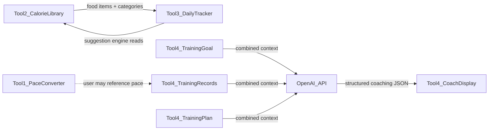
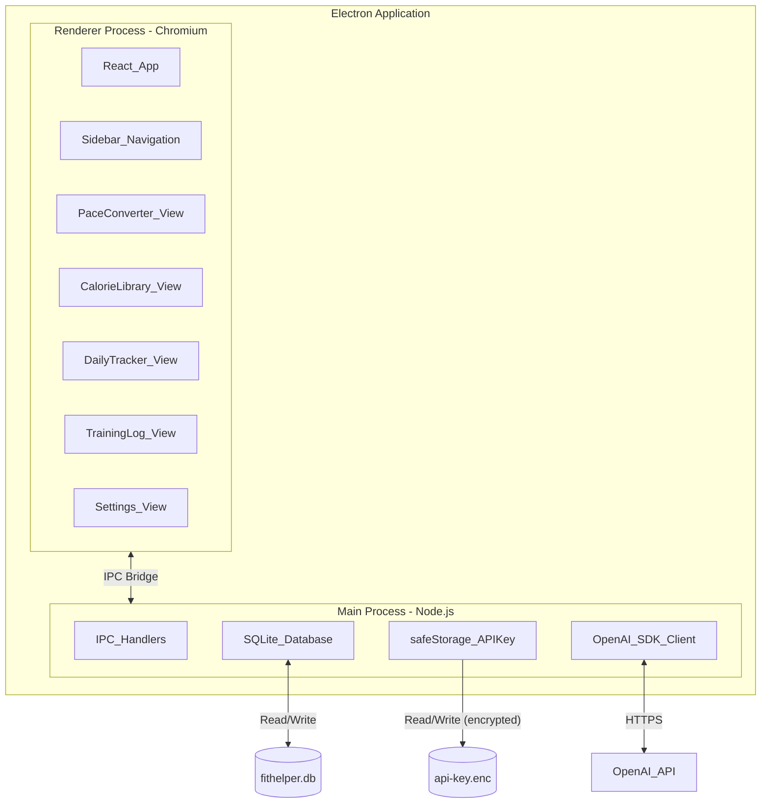
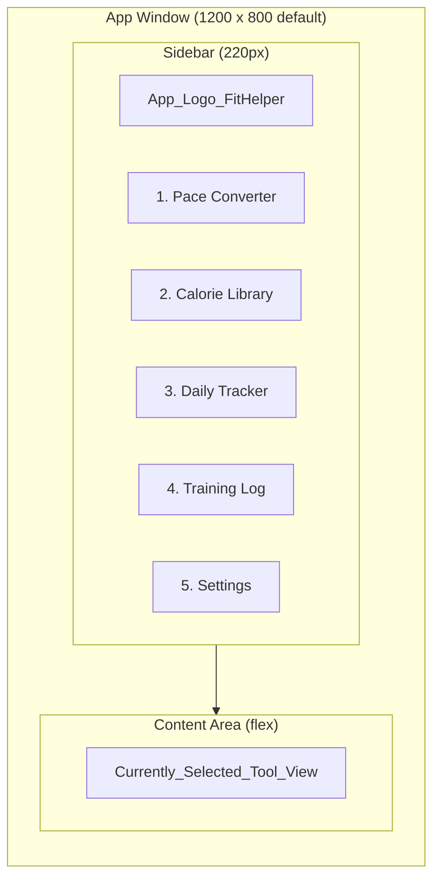

# FitHelper System Design Document

> Version: 0.4.0
>
> A lightweight, intuitive health utility — providing quick, easy-to-understand
> functions that help people save time and live healthier.

---

## Table of Contents

1. [System Functions](#1-system-functions)
2. [Technical Specifications](#2-technical-specifications)
3. [Design Concept](#3-design-concept)

---

## 1. System Functions

### 1.1 Overview

FitHelper is a macOS desktop toolset containing four integrated tools plus a Settings screen:

| Tool | Name | Purpose |
|------|------|---------|
| Tool 1 | 配速转换器 (Pace Converter) | Bidirectional conversion between mph and min/km |
| Tool 2 | 热量参考库 (Calorie Library) | Editable categorized food calorie reference |
| Tool 3 | 每日热量追踪 (Daily Calorie Tracker) | Daily intake tracking with smart food suggestions |
| Tool 4 | 训练日志 + AI教练 (Training Log + AI Coach) | Training records, plans, and LLM-powered coaching |
| Settings | 设置 (Settings) | OpenAI API key configuration |

### 1.2 Cross-Tool Data Flow



### 1.3 Tool 1 — Pace Converter (配速转换器)

**Purpose**: Quickly convert between mph (miles per hour) and min/km (minutes per kilometer), which are the two most common pace/speed formats for runners.

**Features**:

- **Bidirectional conversion**: mph -> min/km and min/km -> mph.
- **min/km format**: Displayed as `M:SS min/km` (e.g., `6:46 min/km` = 6 minutes 46 seconds per kilometer).
- **Recent history**: Persists the last 10 conversions for quick reference. Displayed as a list below the converter, ordered by most recent first. Each entry shows both the input and output values.
- **Input validation**: Accepts decimal mph (e.g., `5.2`) and colon-separated min/km (e.g., `6:46`). Rejects invalid input gracefully with inline error hints.

**User Flow**:

1. User selects conversion direction (mph -> min/km or min/km -> mph).
2. User enters a value.
3. Result displays instantly (computed on keystroke).
4. Conversion is saved to the recent-10 list.

### 1.4 Tool 2 — Calorie Library (热量参考库)

**Purpose**: A personal, editable reference of commonly consumed food items and their calorie values, organized by category.

**Features**:

- **Three categories**: 主食 (Staples), 小食 (Snacks), 酒 (Alcohol).
- **Full CRUD**: User can add, edit, and delete any item in any category.
- **Data per item**: Name (string, supports Chinese/English), Calories (number, supports single value or range like `380/440`), Category (one of the three).
- **Preset data**: Ships with default items from the requirements (see Section 1.4.1). User can modify or remove presets.
- **Search/filter**: Quick text filter across all categories by item name.

#### 1.4.1 Default Preset Data

**主食 (Staples)**

| Item | Calories (kcal) |
|------|-----------------|
| 鸡蛋*1 | 75 |
| 鸡蛋*5 | 375 |
| 咖喱块*1餐 | 300 |
| 鸡肉*1磅 | 600 |
| 洋葱 | 40 |
| 咖喱正餐 | 940 |
| 咖喱小餐 | 630 |
| 炸鸡（breast） | 400 |
| 炸鸡（thigh） | 300 |
| 炸鸡（leg） | 180 |
| 小排骨汤 | 600 |
| 排骨汤*1磅 | 900 |
| 煎干贝 | 220 |
| 泡面 | 380/440 |

**小食 (Snacks)**

| Item | Calories (kcal) |
|------|-----------------|
| 拿铁 | 100 |
| 牛奶 | 100 |
| 橙汁 | 100 |
| 腰果*6 | 50 |
| 椰子水 | 60 |
| 酥饼 | 180 |

**酒 (Alcohol)**

| Item | Calories (kcal) |
|------|-----------------|
| 威士忌1.5oz | 100 |
| 朗姆1.5oz | 100 |
| 啤酒*1罐 | 142 |
| 葡萄酒*半瓶 | 315 |

### 1.5 Tool 3 — Daily Calorie Tracker (每日热量追踪)

**Purpose**: Set a daily calorie target, log food items throughout the day, track eaten vs. planned items, and get smart food suggestions.

**Features**:

- **Daily target**: User sets a calorie goal (e.g., 1800 kcal). Displayed prominently as `current / target` (e.g., `1750/1800`).
  - **Inheritance**: When a new day has no target yet, the system automatically inherits the most recently set target. If no prior target exists at all (first-time use), the default is **1800 kcal**. This is handled server-side by `getOrCreateTarget()` in `dailyTracker.ts`.
- **Item list**: Each entry has a name, calorie value, and an **eaten/planned toggle**.
  - Eaten items contribute to the current sum.
  - Planned items (marked with `+` visually) do not count toward the sum yet but are visible for planning.
- **Drag-to-reorder**: Items can be reordered by dragging to reflect the intended eating sequence.
- **Quick-add from Library**: Tap an item from Tool 2's library to add it to today's list, avoiding manual calorie entry.
- **Manual entry**: User can also type a custom item name + calorie value directly.
- **Auto-calculation**: The current calorie sum updates in real-time as items are toggled between eaten/planned.
- **Category-aware food suggestion**: When the current eaten total is below the target, the system suggests **1 food item** from Tool 2's library. The suggestion algorithm:
  1. Filters items whose calories fit within the remaining budget.
  2. Considers category balance — if the user has eaten mostly 主食, it may suggest 小食 or 酒, and vice versa, promoting variety.
  3. Avoids suggesting items already on today's list.

**User Flow**:

1. User sets or confirms today's calorie target.
2. User adds items (from library or manually).
3. As meals are consumed, user toggles items from planned -> eaten.
4. Running total updates; suggestion appears when under target.
5. User drags items to plan eating order for the rest of the day.

### 1.6 Tool 4 — Training Log + AI Coach (训练日志 + AI教练)

**Purpose**: Record weekly training sessions, maintain a training plan, and receive brief AI-powered coaching analysis.

**Features**:

#### 1.6.1 Training Records

- **Weekly structure**: Records are organized by week (e.g., "Week 83", "Week 84").
- **Daily entries**: Each entry has a date (e.g., `4.6`), optional session label (e.g., `3A`, `5B`), and free-form text for workout details.
- **Workout content**: Supports mixed formats — strength training (e.g., `平板卷腹*5`), treadmill runs (e.g., `5.2 mph × 40 min`), distance/heart-rate (e.g., `3.47mile 心率164`), and personal notes (e.g., `累到`, `进步了`).
- **Input**: Plain text area — the format is intentionally freeform to minimize friction. The user can type exactly as they would in a notebook.

#### 1.6.2 Training Plan

- **Plan storage**: A dedicated text area for the user's structured training plan.
- **Format**: Freeform text supporting phases, weeks, workout types (A/B/C), and milestone goals.
- **Editable**: User can update the plan at any time as the program evolves.

#### 1.6.3 Training Goal

- **Goal input**: A dedicated text field above the tabs where the user enters their current training goal (e.g. "Get a good score in June 21th's Boston 10K race").
- **Persistence**: Stored in a single-row `training_goal` table in the database.
- **Usage**: The goal is included as context in every AI Coach request, so the model can tailor suggestions toward the user's specific objective.

#### 1.6.4 AI Coach

- **Data sent to LLM**: The system combines the training goal, training plan, and training records into a single context payload, then sends it to the OpenAI API.
- **Trigger modes**:
  - **Automatic**: Triggered when the user saves training records **or** the training plan.
  - **Manual**: A "refresh analysis" button the user can press at any time.
- **Response format**: The AI returns a **structured JSON** object containing:
  - **Next training day**: A specific workout suggestion and a 2-sentence reason.
  - **Next training week**: A week-level plan suggestion and a 2-sentence reason.
- **Response display**: The UI parses the JSON and renders it as two clearly separated cards, making it easy for the trainer to read and apply.
- **No token limit**: The API call does not set `max_completion_tokens`, allowing the model to produce a complete response.
- **Model**: `gpt-5.4` via OpenAI API.
- **API key**: Managed via the in-app Settings screen. The key is encrypted using Electron's `safeStorage` API (backed by macOS Keychain) and persisted to `userData/api-key.enc`. Users set the key once; it survives app restarts and updates. A dev-mode fallback reads from `keys/open-ai-api-key.txt` in the working directory.

---

## 2. Technical Specifications

### 2.1 Architecture



### 2.2 Tech Stack

| Layer | Technology | Version / Notes |
|-------|-----------|----------------|
| Desktop shell | Electron | Latest stable |
| Frontend framework | React | 18+ with TypeScript |
| Language | TypeScript | Strict mode |
| Build tool | Vite | Fast HMR for development |
| Database | better-sqlite3 | Synchronous SQLite bindings for Node.js, accessed in main process |
| AI integration | openai (npm) | Official OpenAI SDK |
| Drag-and-drop | @dnd-kit/core | Lightweight, accessible DnD for React |
| Packaging | electron-builder | Produces macOS `.dmg` |
| Linter | ESLint + Prettier | Configured for TypeScript + React |
| Testing | Vitest + React Testing Library | Unit & component tests |

### 2.3 Project Structure

```
fitHelper/
├── doc/
│   ├── projectRequirement.md
│   └── systemDesign.md
├── keys/                        # Dev-only API key fallback (gitignored)
│   └── open-ai-api-key.txt
├── src/
│   ├── main/                    # Electron main process
│   │   ├── index.ts             # App entry, window creation
│   │   ├── ipc/                 # IPC handler modules
│   │   │   ├── converter.ts     # Tool 1 conversion logic
│   │   │   ├── calorieLib.ts    # Tool 2 CRUD
│   │   │   ├── dailyTracker.ts  # Tool 3 tracker logic
│   │   │   ├── training.ts      # Tool 4 records + AI
│   │   │   └── settings.ts      # Settings: API key management
│   │   ├── db/
│   │   │   ├── connection.ts    # SQLite connection setup
│   │   │   ├── migrations.ts    # Schema migrations
│   │   │   └── seed.ts          # Default preset data
│   │   └── services/
│   │       └── openai.ts        # OpenAI API client wrapper
│   ├── renderer/                # React frontend
│   │   ├── index.html
│   │   ├── main.tsx             # React root
│   │   ├── App.tsx              # Layout + router
│   │   ├── components/
│   │   │   ├── Sidebar.tsx
│   │   │   ├── PaceConverter/
│   │   │   ├── CalorieLibrary/
│   │   │   ├── DailyTracker/
│   │   │   ├── TrainingLog/
│   │   │   └── Settings/
│   │   │       └── Settings.tsx  # API key configuration UI
│   │   ├── hooks/               # Custom React hooks
│   │   ├── styles/              # Global styles + theme
│   │   └── i18n/                # Localization files
│   ├── shared/                  # Types shared between main & renderer
│   │   └── types.ts
│   └── preload.ts               # Context bridge for IPC
├── tests/                       # Unit + component tests
├── .gitignore
├── .eslintrc.cjs
├── tsconfig.json
├── vite.config.ts
├── electron-builder.yml
├── package.json
├── LICENSE                      # MIT License
└── README.md
```

### 2.4 SQLite Database Schema

Database file: `~/.fithelper/fithelper.db` (stored in user's home directory, not inside the app bundle).

#### Table: `conversion_history`

| Column | Type | Constraint | Description |
|--------|------|-----------|-------------|
| id | INTEGER | PRIMARY KEY AUTOINCREMENT | |
| input_value | TEXT | NOT NULL | Raw input (e.g., "5.2" or "6:46") |
| input_unit | TEXT | NOT NULL | "mph" or "min_km" |
| output_value | TEXT | NOT NULL | Computed result |
| output_unit | TEXT | NOT NULL | "mph" or "min_km" |
| created_at | TEXT | NOT NULL DEFAULT CURRENT_TIMESTAMP | |

Max 10 rows retained; oldest deleted on insert when count > 10.

#### Table: `calorie_items`

| Column | Type | Constraint | Description |
|--------|------|-----------|-------------|
| id | INTEGER | PRIMARY KEY AUTOINCREMENT | |
| name | TEXT | NOT NULL | Item name (Chinese/English) |
| calories | TEXT | NOT NULL | Calorie value (string to support "380/440" ranges) |
| category | TEXT | NOT NULL CHECK(category IN ('主食','小食','酒')) | |
| sort_order | INTEGER | NOT NULL DEFAULT 0 | Display order within category |
| is_preset | INTEGER | NOT NULL DEFAULT 0 | 1 = shipped with app, 0 = user-created |
| created_at | TEXT | NOT NULL DEFAULT CURRENT_TIMESTAMP | |
| updated_at | TEXT | NOT NULL DEFAULT CURRENT_TIMESTAMP | |

#### Table: `daily_targets`

| Column | Type | Constraint | Description |
|--------|------|-----------|-------------|
| id | INTEGER | PRIMARY KEY AUTOINCREMENT | |
| date | TEXT | NOT NULL UNIQUE | ISO date "YYYY-MM-DD" |
| target_calories | INTEGER | NOT NULL | Daily calorie goal |

A row is auto-created on first access for any date. The value is inherited from the most recent previous day's target, or defaults to 1800 kcal if no history exists.

#### Table: `daily_items`

| Column | Type | Constraint | Description |
|--------|------|-----------|-------------|
| id | INTEGER | PRIMARY KEY AUTOINCREMENT | |
| date | TEXT | NOT NULL | FK reference date in daily_targets |
| name | TEXT | NOT NULL | Food item name |
| calories | INTEGER | NOT NULL | Calorie value (resolved to single number) |
| is_eaten | INTEGER | NOT NULL DEFAULT 0 | 1 = eaten, 0 = planned |
| sort_order | INTEGER | NOT NULL DEFAULT 0 | Drag-reorder position |
| calorie_item_id | INTEGER | NULL | FK to calorie_items.id if added from library |
| created_at | TEXT | NOT NULL DEFAULT CURRENT_TIMESTAMP | |

#### Table: `training_records`

| Column | Type | Constraint | Description |
|--------|------|-----------|-------------|
| id | INTEGER | PRIMARY KEY AUTOINCREMENT | |
| content | TEXT | NOT NULL | Full freeform training log text |
| updated_at | TEXT | NOT NULL DEFAULT CURRENT_TIMESTAMP | |

Single-row table — the entire training log is stored as one text blob, matching the user's notebook-style workflow.

#### Table: `training_plan`

| Column | Type | Constraint | Description |
|--------|------|-----------|-------------|
| id | INTEGER | PRIMARY KEY AUTOINCREMENT | |
| content | TEXT | NOT NULL | Full freeform training plan text |
| updated_at | TEXT | NOT NULL DEFAULT CURRENT_TIMESTAMP | |

Single-row table — same rationale as training_records.

#### Table: `training_goal`

| Column | Type | Constraint | Description |
|--------|------|-----------|-------------|
| id | INTEGER | PRIMARY KEY AUTOINCREMENT | |
| content | TEXT | NOT NULL DEFAULT '' | User's training goal text (e.g. "Boston 10K on June 21") |
| updated_at | TEXT | NOT NULL DEFAULT CURRENT_TIMESTAMP | |

Single-row table — stores the user's current training objective. Initialized with an empty string. Included in every AI Coach request as context.

#### Table: `ai_coach_history`

| Column | Type | Constraint | Description |
|--------|------|-----------|-------------|
| id | INTEGER | PRIMARY KEY AUTOINCREMENT | |
| prompt_hash | TEXT | NOT NULL | Hash of input sent to avoid duplicate API calls |
| response | TEXT | NOT NULL | AI-generated coaching text |
| model | TEXT | NOT NULL | Model identifier used |
| created_at | TEXT | NOT NULL DEFAULT CURRENT_TIMESTAMP | |

Caches recent AI responses to avoid redundant API calls when content hasn't changed.

### 2.5 OpenAI API Integration

#### Configuration

- **Model**: `gpt-5.4` (model id: `gpt-5.4`)
- **API key source**: Encrypted via Electron `safeStorage` (macOS Keychain) and stored at `userData/api-key.enc`. Users configure the key through the in-app Settings screen. A dev-mode fallback reads from `keys/open-ai-api-key.txt` in the working directory. The decrypted key is held in main-process memory only — never written to the database.
- **No token limit**: The `max_completion_tokens` parameter is **not** set, allowing the model to produce a complete response without truncation.
- **Response format**: `response_format: { type: 'json_object' }` to enforce valid JSON output.
- **Temperature**: 0.7 (balanced between consistency and variety).

#### Prompt Design

The system prompt instructs the model to act as a structured running coach that returns JSON:

```
System: You are a concise running and fitness coach. The user will provide
their training goal, training plan, and training log. Analyze their current
progress against the plan and goal.

You MUST reply with valid JSON only, no markdown, no extra text.
Use this exact schema:

{
  "next_training_day": {
    "plan": "<specific workout suggestion for the next training day>",
    "reason": "<2-sentence explanation>"
  },
  "next_training_week": {
    "plan": "<training plan suggestion for the coming week>",
    "reason": "<2-sentence explanation>"
  }
}

Reply in the same language as the user's data.
```

The user message concatenates:

```
Training Goal:
{training_goal.content}

Training Plan:
{training_plan.content}

Training Records:
{training_records.content}
```

#### Response Schema

The AI response is parsed into a `CoachSuggestion` object:

```typescript
interface CoachSuggestion {
  next_training_day: {
    plan: string;   // specific workout suggestion
    reason: string; // 2-sentence explanation
  };
  next_training_week: {
    plan: string;   // week-level plan suggestion
    reason: string; // 2-sentence explanation
  };
}
```

If JSON parsing fails, the raw text is displayed as a fallback.

#### Trigger Logic

1. **Auto-trigger**: After the user saves an edit to training records **or** the training plan, compute a SHA-256 hash of (goal + plan + records). If the hash differs from the most recent `ai_coach_history.prompt_hash`, call the API and cache the result.
2. **Manual trigger**: Always calls the API regardless of hash (user explicitly wants a fresh analysis).

### 2.6 IPC Channel Definitions

All renderer-to-main communication goes through Electron IPC with typed channels:

| Channel | Direction | Payload | Response |
|---------|-----------|---------|----------|
| `converter:convert` | renderer -> main | `{ value: string, fromUnit: 'mph' \| 'min_km' }` | `{ result: string, toUnit: string }` |
| `converter:getHistory` | renderer -> main | — | `ConversionRecord[]` |
| `calorie:getAll` | renderer -> main | — | `CalorieItem[]` |
| `calorie:create` | renderer -> main | `CalorieItem` (no id) | `CalorieItem` |
| `calorie:update` | renderer -> main | `CalorieItem` | `CalorieItem` |
| `calorie:delete` | renderer -> main | `{ id: number }` | `void` |
| `daily:getTarget` | renderer -> main | `{ date: string }` | `DailyTarget` |
| `daily:setTarget` | renderer -> main | `DailyTarget` | `void` |
| `daily:getItems` | renderer -> main | `{ date: string }` | `DailyItem[]` |
| `daily:addItem` | renderer -> main | `DailyItem` (no id) | `DailyItem` |
| `daily:updateItem` | renderer -> main | `DailyItem` | `void` |
| `daily:deleteItem` | renderer -> main | `{ id: number }` | `void` |
| `daily:reorder` | renderer -> main | `{ ids: number[] }` | `void` |
| `daily:suggest` | renderer -> main | `{ date: string }` | `CalorieItem \| null` |
| `training:getGoal` | renderer -> main | — | `string` |
| `training:saveGoal` | renderer -> main | `{ content: string }` | `void` |
| `training:getRecords` | renderer -> main | — | `string` |
| `training:saveRecords` | renderer -> main | `{ content: string }` | `void` |
| `training:getPlan` | renderer -> main | — | `string` |
| `training:savePlan` | renderer -> main | `{ content: string }` | `void` |
| `training:getCoachSuggestion` | renderer -> main | `{ force: boolean }` | `CoachSuggestion \| string` |
| `settings:getApiKeyStatus` | renderer -> main | — | `{ configured: boolean }` |
| `settings:setApiKey` | renderer -> main | `{ key: string }` | `void` |
| `settings:clearApiKey` | renderer -> main | — | `void` |

### 2.7 Conversion Formulas (Tool 1)

**mph to min/km**:

```
km_per_hour = mph * 1.60934
min_per_km  = 60 / km_per_hour
minutes     = floor(min_per_km)
seconds     = round((min_per_km - minutes) * 60)
result      = "{minutes}:{seconds padded to 2 digits} min/km"
```

**min/km to mph**:

```
total_minutes = minutes + (seconds / 60)
km_per_hour   = 60 / total_minutes
mph           = km_per_hour / 1.60934
result        = round to 1 decimal place
```

### 2.8 Food Suggestion Algorithm (Tool 3)

```
function suggest(date):
    remaining = target_calories - sum(eaten items for date)
    if remaining <= 0: return null

    todayNames = set of item names already on today's list
    candidates = calorie_items where
        max_calories(item) <= remaining AND
        item.name NOT IN todayNames

    if candidates is empty: return null

    eatenCategories = count eaten items by category for today
    totalEaten = sum(eatenCategories values)

    for each candidate:
        categoryRatio = eatenCategories[candidate.category] / totalEaten
        score = (1 - categoryRatio) * weight_diversity
              + (candidate.calories / remaining) * weight_fit

    return candidate with highest score
```

The algorithm favors items from under-represented categories while preferring items whose calorie count closely fits the remaining budget.

### 2.9 Build & Packaging

- **Development**: `npm run dev` — starts Vite dev server + Electron in watch mode.
- **Production build**: `npm run build` — compiles TypeScript, bundles with Vite, packages with electron-builder.
- **Output**: macOS `.dmg` installer targeting arm64 + x64 (universal binary).
- **Auto-update**: Not required for v0.1. Can be added later with `electron-updater`.

---

## 3. Design Concept

### 3.1 Visual Style — Minimalist Dark Mode

The interface uses a dark color palette with high-contrast accents for readability and reduced eye strain.

#### Color Palette

| Role | Color | Usage |
|------|-------|-------|
| Background (primary) | `#1A1A2E` | Main content area |
| Background (sidebar) | `#16213E` | Sidebar navigation |
| Surface / card | `#0F3460` | Cards, input fields, panels |
| Text (primary) | `#E8E8E8` | Body text, labels |
| Text (secondary) | `#A0A0B0` | Hints, placeholders, secondary info |
| Accent (primary) | `#53C9B1` | Active states, primary buttons, links |
| Accent (success) | `#4ADE80` | Eaten items, completed checkmarks |
| Accent (warning) | `#FBBF24` | Planned items, pending markers |
| Accent (danger) | `#F87171` | Delete actions, over-target warnings |
| Border | `#2A2A4A` | Subtle dividers, input borders |

#### Typography

- **Font**: System font stack (`-apple-system, BlinkMacSystemFont, "PingFang SC", "Helvetica Neue", sans-serif`) — supports Chinese characters natively on macOS.
- **Sizes**: 14px base, 12px secondary, 18px headings, 24px page titles.
- **Monospace** (for numbers, pace values): `"SF Mono", "Menlo", monospace`.

### 3.2 Layout — Sidebar Navigation



- **Sidebar** (fixed width 220px, left side): Displays the app name/logo at top, followed by 4 tool navigation items and a Settings item. The active item is highlighted with the accent color and a left border indicator.
- **Content area** (flexible, right side): Renders the selected tool's view. Scrollable independently of the sidebar.
- **Window size**: Default 1200 x 800px, minimum 900 x 600px. Resizable.

### 3.3 Tool View Layouts

#### 3.3.1 Pace Converter

```
┌──────────────────────────────────────┐
│  Pace Converter / 配速转换器          │
│                                      │
│  [mph ▼]  ──►  [min/km]             │
│  ┌─────────┐      ┌──────────┐      │
│  │  5.2    │  =   │ 7:24     │      │
│  └─────────┘      └──────────┘      │
│       ◄── click to swap direction   │
│                                      │
│  Recent Conversions                  │
│  ┌──────────────────────────────┐   │
│  │ 5.2 mph  →  7:24 min/km     │   │
│  │ 6:46 min/km  →  5.5 mph     │   │
│  │ ...                          │   │
│  └──────────────────────────────┘   │
└──────────────────────────────────────┘
```

- Swap button between the two input fields to reverse direction.
- Result computes after typing stops (debounced 600ms) or immediately on Enter key.
- Recent list below, max 10 items, most recent first.

#### 3.3.2 Calorie Library

```
┌──────────────────────────────────────┐
│  Calorie Library / 热量参考库         │
│                                      │
│  [🔍 Search...]         [+ Add Item] │
│                                      │
│  ── 主食 ──────────────────────────  │
│  │ 鸡蛋*1          75 kcal  [✎][✕]│ │
│  │ 咖喱正餐        940 kcal [✎][✕]│ │
│  │ ...                              │ │
│                                      │
│  ── 小食 ──────────────────────────  │
│  │ 拿铁            100 kcal  [✎][✕]│ │
│  │ ...                              │ │
│                                      │
│  ── 酒 ────────────────────────────  │
│  │ 威士忌1.5oz     100 kcal  [✎][✕]│ │
│  │ ...                              │ │
└──────────────────────────────────────┘
```

- Items grouped under category headers.
- Inline edit (pencil icon) and delete (X icon) per item.
- "Add Item" opens a modal/inline form: name, calories, category dropdown.
- Search bar filters across all categories in real-time.

#### 3.3.3 Daily Calorie Tracker

```
┌──────────────────────────────────────┐
│  Daily Tracker / 每日热量追踪         │
│  Date: 2026-04-26     Target: [1800] │
│                                      │
│  ┌────────────────────────────────┐  │
│  │      1150 / 1800 kcal         │  │
│  │      ████████████░░░░░░░░░    │  │
│  │  ✅ Eaten: 870 kcal           │  │
│  │              ⏳ Planned: 280 kcal│ │
│  └────────────────────────────────┘  │
│                                      │
│  ☰ [✓] 咖啡              120 kcal ✕│
│  ☰ [✓] 小咖喱            630 kcal ✕│
│  ☰ [✓] 咖啡              120 kcal ✕│
│  ☰ [ ] + 小咖喱          630 kcal ✕│
│  ☰ [ ] + 冰淇淋          100 kcal ✕│
│  ☰ [ ] + 威士忌          150 kcal ✕│
│                                      │
│  [+ Add from Library]  [+ Manual]    │
│                                      │
│  ┌─ Suggestion ─────────────────┐   │
│  │ 还差 650 kcal，建议:          │   │
│  │ 🍽 炸鸡（breast） 400 kcal   │   │
│  │ (category: 主食, good fit)    │   │
│  │            [+ Add to list]    │   │
│  └───────────────────────────────┘   │
└──────────────────────────────────────┘
```

- **Default target**: On first visit to a date, a default target of 1800 kcal is auto-saved so the progress bar and suggestion render immediately.
- **Progress bar**: Visual representation of current/target. Color changes: green (under 80%), yellow (80-100%), red (over 100%).
- **Eaten / Planned sums**: Below the progress bar, two separate totals are displayed — eaten sum (checked items) and planned sum (unchecked items).
- **Item list**: Each row has a drag handle (☰), eaten/planned toggle (checkbox), name, calories, and a delete button (✕). Eaten items show a filled green checkbox with checkmark; planned items show an empty yellow-outlined checkbox with a `+` prefix on the name.
- **Drag-to-reorder**: Grab the ☰ handle to reorder items (eating sequence planning).
- **Suggestion card**: Appears when current eaten total < target. Shows one recommended item with a quick "Add to list" button.

#### 3.3.4 Training Log + AI Coach

```
┌──────────────────────────────────────────┐
│  Training Log / 训练日志 + AI教练         │
│                                          │
│  🎯 Goal: [Get a good score in June     ]│
│  [       21th's Boston 10K race         ]│
│                                          │
│  [Records]  [Plan]                       │
│  ─────────────────────────────────────── │
│  ┌────────────────────────────────────┐  │
│  │ Week 85                            │  │
│  │ 4.20                               │  │
│  │ 平板卷腹*4                         │  │
│  │ 腿推*5                             │  │
│  │ ...                                │  │
│  │                                    │  │
│  │ 4.25                               │  │
│  │ 5C                                 │  │
│  │ 4.8 mph × 65 min                  │  │
│  │ 7:46 心率161                       │  │
│  │ 合理的降速                         │  │
│  └────────────────────────────────────┘  │
│                                          │
│  ┌─ AI Coach ─────────── [🔄 Refresh]──┐│
│  │                                      ││
│  │  📅 Next Training Day                ││
│  │  ┌──────────────────────────────┐    ││
│  │  │ 5.0 mph × 50 min, HR < 170  │    ││
│  │  │                              │    ││
│  │  │ 心率控制良好，可以小幅提速。 │    ││
│  │  │ 保持有氧基础，避免过度疲劳。 │    ││
│  │  └──────────────────────────────┘    ││
│  │                                      ││
│  │  📋 Next Training Week               ││
│  │  ┌──────────────────────────────┐    ││
│  │  │ A课: 5.0×50min, B课: 间歇,  │    ││
│  │  │ C课: 4.8×65min              │    ││
│  │  │                              │    ││
│  │  │ 第6周应巩固耐力基础。       │    ││
│  │  │ 长跑可尝试突破70分钟。      │    ││
│  │  └──────────────────────────────┘    ││
│  └──────────────────────────────────────┘│
└──────────────────────────────────────────┘
```

- **Goal field**: A text input above the tabs where the user enters their training objective. Auto-saves on blur. Included in every AI Coach request.
- **Tab toggle** between Records and Plan views — both are plain text editors.
- **AI Coach panel** sits below the text area, always visible. Renders the structured JSON response as two cards: "Next Training Day" and "Next Training Week", each showing the plan suggestion and a 2-sentence reason.
- **Refresh button** (🔄) triggers a manual API call.
- **Auto-trigger** fires when user finishes editing records **or plan** and saves (blur or Cmd+S).
- **Loading state**: Shows a subtle spinner while waiting for the API response.
- **Error fallback**: If the AI response is not valid JSON (e.g. error message), it is displayed as plain pre-wrapped text.

### 3.4 Interaction Patterns

| Pattern | Implementation |
|---------|---------------|
| Real-time calculation | Tool 1 converts after typing stops (600ms debounce) or on Enter; Tool 3 recalculates sum on toggle/add/delete |
| Drag-and-drop | Tool 3 uses @dnd-kit for accessible, smooth reordering with visual placeholder |
| Inline editing | Tool 2 items switch to edit mode in-place (no modal for simple edits) |
| Confirmation | Destructive actions (delete item, clear history) show a brief confirmation tooltip, not a disruptive modal |
| Keyboard shortcuts | Cmd+1/2/3/4/5 to switch tools/settings; Cmd+S to save in Tool 4; Esc to cancel edits |
| Loading states | Skeleton placeholders for initial data load; inline spinner for AI responses |
| Error handling | Inline error messages near the relevant field; toast notifications for system-level errors (DB failure, API error) |

### 3.5 Internationalization (i18n)

- **Default language**: Chinese (中文).
- **Supported languages**: Chinese, English.
- **Implementation**: `react-i18next` with JSON translation files.
- **Scope**: All UI labels, buttons, placeholders, and system messages are localized. User-generated content (food names, training notes) is not translated.
- **Switching**: A language toggle in the sidebar footer. Preference persisted in SQLite (or localStorage).
- **Detection**: On first launch, follows macOS system locale. If locale is `zh-*`, uses Chinese; otherwise defaults to English.

### 3.6 Responsiveness & Window Behavior

- **Minimum window size**: 900 x 600px.
- **Default window size**: 1200 x 800px.
- **Sidebar**: Fixed width (220px), does not collapse. At minimum width, the content area is still 680px — sufficient for all tool views.
- **Remembers position**: Window position and size are persisted across sessions via `electron-window-state`.

---

*End of System Design Document — FitHelper v0.4.0*
